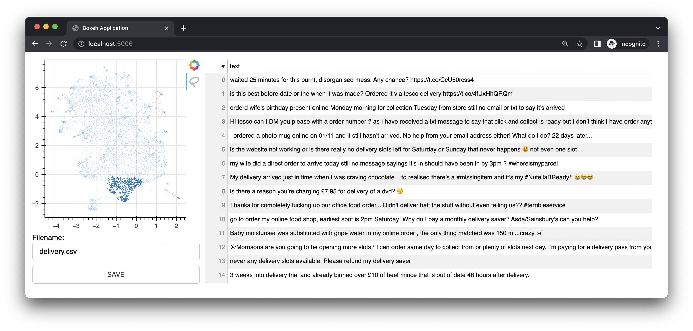
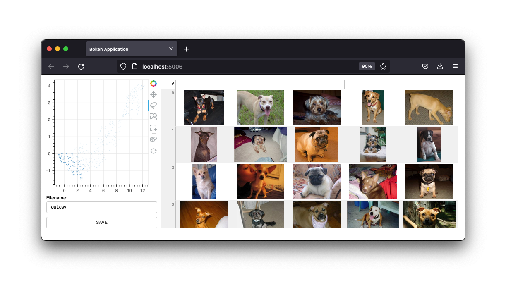

### bulk

Bulk is a quick developer tool to apply some bulk labels. Given a prepared dataset with 2d embeddings it can generate an interface that allows you to quickly add some bulk, albeit less precice, annotations.

## Install 

```
python -m pip install --upgrade pip
python -m pip install bulk
```

## Notebook Features

The future of bulk is to offer widgets that can help you in the notebook. At the moment, the `BaseTextExplorer` is the main widget that is supported. Given some preprocessed data, you can use the explorer to poke around a 2D UMAP of text embeddings. 

<details>
  <summary><b>Show me the preprocessing code.</b></summary>

```python
import pandas as pd
from umap import UMAP
from sklearn.pipeline import make_pipeline 

# pip install "embetter[text]"
from embetter.text import SentenceEncoder

# Build a sentence encoder pipeline with UMAP at the end.
enc = SentenceEncoder('all-MiniLM-L6-v2')
umap = UMAP()

text_emb_pipeline = make_pipeline(
  enc, umap
)

# Load sentences
sentences = list(pd.read_csv("tests/data/text.csv")['text'])

# Calculate embeddings 
X_tfm = text_emb_pipeline.fit_transform(sentences)

# Write to disk. Note! Text column must be named "text"
df = pd.DataFrame({"text": sentences})
df['x'] = X_tfm[:, 0]
df['y'] = X_tfm[:, 1]
````
</details>

To use the widget, you just need to run this: 

```python
from bulk.widgets import BaseTextExplorer

widget = BaseTextExplorer(df)
widget.show()
```

This will allow us to quickly explore the clusters that appear in our data. You can hold the mouse cursor to go into selection mode and when you select items you will see a random subset appear on the right. You can resample from your selection by clicking the resample button.

https://github.com/user-attachments/assets/6a0f2386-356b-4c50-80ef-7ab06f815d3a

When you make selections you can see the widget on the right update, but you can also grab the data from a Python attribute. 

```python
widget.selected_idx
widget.selected_texts
widget.selected_dataframe
```

Being able to explore these clusters is neat, but it feels like we might more easily explore everything if we have some more tools at our disposal. In particular, we want to have an encoder around so that we may use queries in our embedded space. The UI below will allow us to explore much more interactively by updating colors with a text prompt.

```python
from embetter.text import SentenceEncoder

enc = SentenceEncoder('all-MiniLM-L6-v2')

# Pay attention here! The rows in df needs to align with the rows in X!
widget = BaseTextExplorer(df, X=X, encoder=enc)
widget.show()
```

https://github.com/user-attachments/assets/dd948815-6866-4cf1-8ef0-8045093b5904


Thanks to tools like [ipywidget](https://ipywidgets.readthedocs.io/en/stable/) and [anywidget](https://anywidget.dev/), we can really start building some tools to keep the notebook the go-to place for your data needs. Given some proper widgets, you will never be able to out-notebook a Jupyter notebook! 

The primary interest of this project is to work on tools for data quality. Being able to select datapoints in bulk feels like a great place to start. Maybe you can find an interesting subset to annotate first, maybe you get suprised when you see two distinct clusters that should be one. All that good stuff can happen in the notebook!

## App Features 

Bulk also comes with a small web app that uses Bokeh to give you annotation interfaces based on UMAP representations of embeddings. It offers an interface for text. This interface was the original interface/feature of this project. 



It also features an image interface. 



We will keep these interfaces around, but the future of this project will be widgets from a Jupyter notebook. As is however, the webapp is certainly still useful. 

## Learn

If you're curious to learn more, you may appreciated [this video on YouTube](https://www.youtube.com/watch?v=gDk7_f3ovIk&ab_channel=Explosion) for text and [this video on YouTube](https://youtu.be/DmH3JmX3w2I) for computer vision.

## Bulk Text 

To use bulk for text, you'll first need to prepare a csv file first.

> **Note**
>
> The example below uses [embetter](https://github.com/koaning/embetter) to generate the embeddings and [umap](https://umap-learn.readthedocs.io/) to reduce the dimensions. But you're  totally free to use what-ever text embedding tool that you like. You will need to install these tools seperately. Note that embetter uses  [sentence-transformers](https://www.sbert.net/) under the hood.

```python
import pandas as pd
from umap import UMAP
from sklearn.pipeline import make_pipeline 

# pip install "embetter[text]"
from embetter.text import SentenceEncoder

# Build a sentence encoder pipeline with UMAP at the end.
text_emb_pipeline = make_pipeline(
  SentenceEncoder('all-MiniLM-L6-v2'),
  UMAP()
)

# Load sentences
sentences = list(pd.read_csv("original.csv")['sentences'])

# Calculate embeddings 
X_tfm = text_emb_pipeline.fit_transform(sentences)

# Write to disk. Note! Text column must be named "text"
df = pd.DataFrame({"text": sentences})
df['x'] = X_tfm[:, 0]
df['y'] = X_tfm[:, 1]
df.to_csv("ready.csv", index=False)
```

You can now use this `ready.csv` file to apply some bulk labelling. 

```
python -m bulk text ready.csv
```

If you're looking for an example file to play around with you can download
[the demo .csv file](https://github.com/koaning/bulk/blob/main/utils/df.csv) in this repository. This dataset 
contains a subset of a dataset found on Kaggle. You can find the original [here](https://www.kaggle.com/datasets/thoughtvector/customer-support-on-twitter).

### Extra Settings

You can also pass an extra column to your csv file called "color". This column will then be used to color the points in the interface. 

You can also pass `--keywords` to the command line app to highlight elements that contain specific keywords.

```
python -m bulk text ready.csv --keywords "deliver,card,website,compliment"
```

## Bulk Image

The example below uses the `embetter` library to create a dataset for bulk labelling images. 

> **Note**
>
> The example below uses [embetter](https://github.com/koaning/embetter) to generate the embeddings and [umap](https://umap-learn.readthedocs.io/) to reduce the dimensions. But you're  totally free to use what-ever text embedding tool that you like. You will need to install these tools seperately. Note that embetter uses [TIMM](https://github.com/rwightman/pytorch-image-models) under the hood.

```python
import pathlib
import pandas as pd
from sklearn.pipeline import make_pipeline 
from umap import UMAP
from sklearn.preprocessing import MinMaxScaler

# pip install "embetter[vision]"
from embetter.grab import ColumnGrabber
from embetter.vision import ImageLoader, TimmEncoder

# Build image encoding pipeline
image_emb_pipeline = make_pipeline(
    ColumnGrabber("path"),
    ImageLoader(convert="RGB"),
    TimmEncoder('xception'),
    UMAP(),
    MinMaxScaler()
)

# Make dataframe with image paths
img_paths = list(pathlib.Path("downloads", "pets").glob("*"))
dataf = pd.DataFrame({
    "path": [str(p) for p in img_paths]
})

# Make csv file with Umap'ed model layer 
# Note! Bulk assumes the image path column to be called "path"!
X = image_emb_pipeline.fit_transform(dataf)
dataf['x'] = X[:, 0]
dataf['y'] = X[:, 1]
dataf.to_csv("ready.csv", index=False)
```

This generates a csv file that can be loaded in bulk via; 

```
python -m bulk image ready.csv
```

### Pre-Processing
You can also generate a set of thumbnails for your images. This can be useful if you're working with a large dataset. 

```
python -m bulk util resize ready.csv ready2.csv temp   
```

This will create a folder called `temp` with all the resized images. You can then use this folder as the `--thumbnail-path` argument.

```
python -m bulk image ready2.csv --thumbnail-path temp
```


## Download 

You can also use bulk to download some datasets to play with. For more info:

```
python -m bulk download --help
```

## Usecase 

The interface may help you label very quickly, but the labels themselves may be fairly noisy. The intended use-case for this tool is to prepare interesting subsets to be used later in [prodi.gy](https://prodi.gy). 
