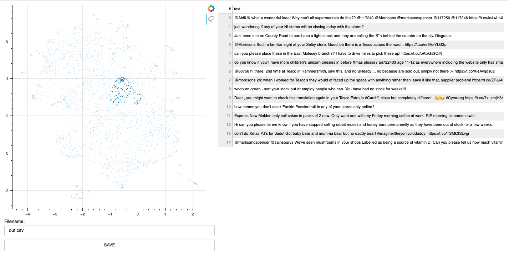

# bulk

Bulk is a quick developer tool to apply some bulk labels. Given a prepared dataset with 2d embeddings it can generate an interface that allows you to quickly add some bulk, albeit less precice, annotations.



# Install 

```
python -m pip install --upgrade pip
python -m pip install bulk
```

## Usage

To use bulk, you'll first need to prepare a csv file for the lasso widget.

> **Note**
> The example below uses the [universal sentence encoder](https://tfhub.dev/google/universal-sentence-encoder/4) but you're
> totally free to use what-ever text embedding tool that you like.
> You may also enjoy [whatlies](https://koaning.github.io/whatlies/tutorial/scikit-learn/) or [sentence transformers](https://www.sbert.net/examples/applications/computing-embeddings/README.html). You will
> need to install these tools seperately.


```python
import pandas as pd
from umap import UMAP
import tensorflow_hub as hub

# Load the universal sentence encoder
embed = hub.load("https://tfhub.dev/google/universal-sentence-encoder/4")

# Load original dataset
df = pd.read_csv("original.csv")

# Apply embeddings 
X = embed(df['text'])

# Reduce the dimensions with UMAP
umap = UMAP()
X_tfm = umap.fit_transform(X)

# Apply coordinates
df['x'] = X_tfm[:, 0]
df['y'] = X_tfm[:, 1]
df.to_csv("ready.csv")
```

You can now use this `ready.csv` file to apply some bulk labelling. 

```
python -m bulk text ready.csv
```

## Usecase 

The interface may help you label very quickly, but the labels themselves may be faily noisy. The intended use-case for this tool is to prepare interesting subsets to be used later in [prodi.gy](https://prodi.gy). 
